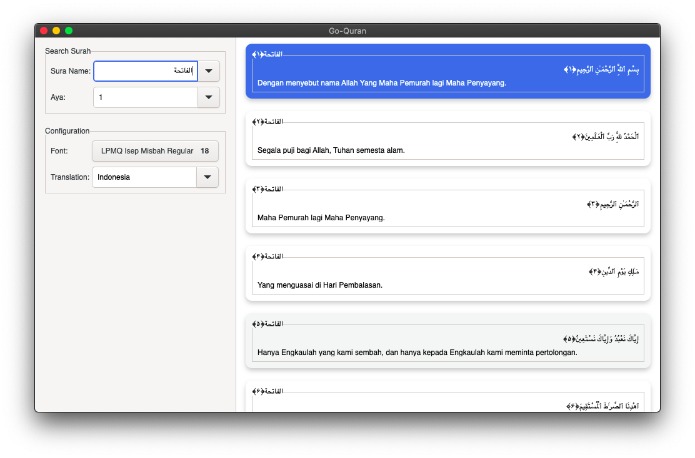

# go-quran
Simple Quran App Build using gtk3 and golang


This is proof-of-concept application is specially made for linux, we use gtk3 as a GUI library and Golang as language.

All Resource of translation and quran from [Tanzil.org](https://www.tanzil.org)


# How To Run

- Linux
    ```
    On Linux its requre some dependencies (GTK3, Golang)
    ```
    ```bash
    Installation dependenscies
    sudo apt install libgtk-3-dev golang
    ```
    ```bash 
    Runing 
    git clone https://github.com/ibrahim4529/go-quran.git
    cd go-quran
    go get && go build . && ./go-quran
    ```

- Mac
    ```
    On Mac its requre some dependencies (Brew, GTK3, Golang)
    ```
    ```bash
    Installation dependenscies using brew
    brew install gtk+3 golang
    ```
    ```bash 
    Runing 
    git clone https://github.com/ibrahim4529/go-quran.git
    cd go-quran
    go get && go build . && ./go-quran
    ```
- Window
    ```
    Currently Not Available
    ```

## Fetures List
- [x] Go To Surah And Aya 
- [x] Change Translation
- [ ] Implement Mushaf Paging
- [ ] Dynamic Add Translation 
- [ ] Dynamic Add Type mushaf
- [ ] Recitation 
